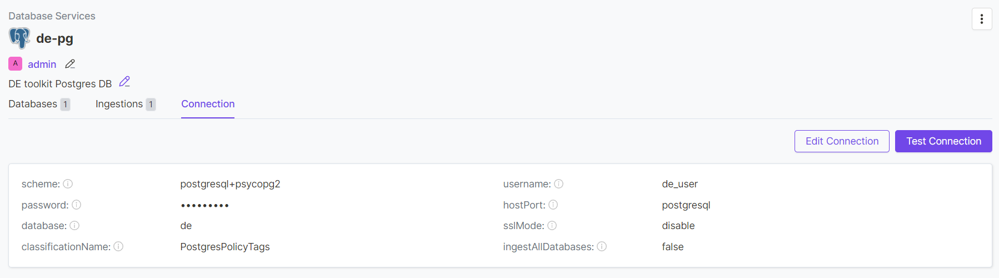
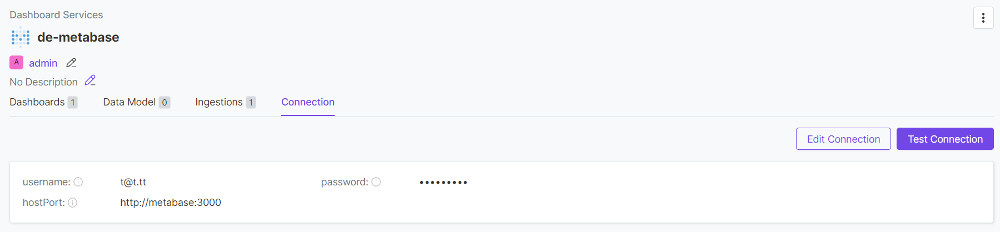
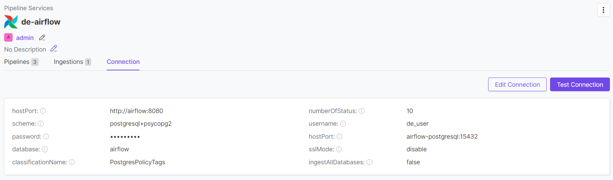

# Open Metadata
Open Metadata is a metadata management solution that provides data discovery, governance, data quality, observability, and collaboration features.

# How to use

1. Run OpenMetadata
```bash
docker-compose up -d
```

2. Start additional services to ingest metadata from them:
```bash
cd ../postgresql
docker-compose up -d
cd ../airflow
docker-compose up -d
cd ../metabase
docker-compose up -d
```

3. Configure connections to the running services through the Open Metadata UI.

[Databases](http://localhost:8585/settings/services/databases)


[Dashboards](http://localhost:8585/settings/services/dashboards)


[Pipelines](http://localhost:8585/settings/services/pipelines)

